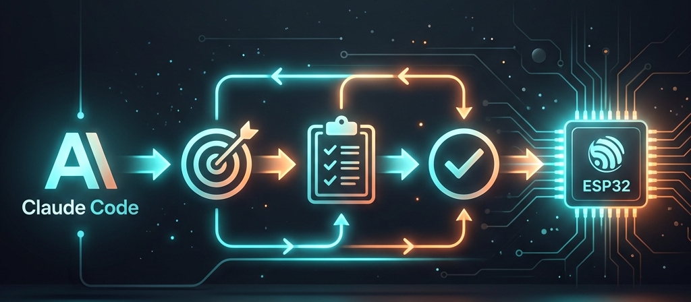

<div align="center">

# ⚡ ESP32 Claude Workbench



**Deterministic AI workflow for ESP32 firmware development.**

[](https://github.com/agodianel/esp32-claude-workbench/actions/workflows/ci.yml)
[](https://www.python.org/downloads/)
[](LICENSE)

*Stop prompting. Start engineering.*

[Quick Start](#-quick-start) · [Skills](#-skills) · [Playbooks](#-debug-playbooks) · [Testing](#-testing-strategy) · [Contributing](#-contributing)

</div>

---

## 🎯 What Is This?

ESP32 Claude Workbench is a **structured workflow system** for using Claude Code in ESP32 firmware development. It turns ad-hoc AI prompting into a disciplined, testable, repeatable development process.

This is **not** another prompt collection. It is a reliability layer for AI-assisted embedded development.

### The Problem

Most AI coding setups fail in firmware because they are:

| Problem | Impact |
|---------|--------|
| Too chat-based | No persistent state across sessions |
| Not hardware-aware | Wrong pin assumptions, unsafe RTOS calls |
| Weak on testing | Code compiles but doesn't work |
| Hard to review | AI-generated changes lack rationale and evidence |
| No debugging flow | Same Guru Meditation errors waste hours repeatedly |

### The Solution

This repository provides:

- 🏗️ **Structured workflows** — Mission files, implementation contracts, review checklists
- 🧠 **Persistent state** — Markdown-based task memory across sessions
- 🔧 **ESP32-specific rules** — Pin constraints, RTOS safety, memory management
- 🧪 **Testing-first approach** — pytest-based validation from day one
- 🐛 **Debug playbooks** — Standardized triage for common firmware failures
- 📋 **Auditable artifacts** — Every change has rationale, tests, and risk notes

---

## 🚀 Quick Start

### Install

```bash
# Clone the repository
git clone https://github.com/agodianel/esp32-claude-workbench.git
cd esp32-claude-workbench

# Create virtual environment
python3 -m venv .venv
source .venv/bin/activate

# Install for development
pip install -e ".[dev]"
```

### Run Tests

```bash
pytest tests/ -v
```

### Start a Mission

1. Copy the mission template:
   ```bash
   cp missions/templates/mission_template.md missions/2026-03-my-feature.md
   ```

2. Fill in the sections: Goal, Board, Constraints, Acceptance Criteria.

3. Use Claude to generate an implementation contract:
   ```bash
   generate-contract "Add Wi-Fi reconnection with exponential backoff" \
     --files "main/wifi_manager.c|CREATE|Reconnection handler" \
     --tests "Verify backoff timing" "Test retry counter reset" \
     --risks "Race condition on shared connection flag"
   ```

4. Review the contract, then implement.

5. Validate your mission file:
   ```bash
   validate-mission missions/2026-03-my-feature.md
   ```

---

## 📁 Repository Structure

```
esp32-claude-workbench/
├── CLAUDE.md                    # Claude Code rules for ESP32
├── CONTRIBUTING.md              # Contribution guide
├── .claude/skills/              # Claude Code skill definitions
│   ├── repo_scout/              #   Scan project structure
│   ├── feature_contract/        #   Generate implementation contracts
│   ├── esp32_pin_audit/         #   Audit GPIO pin usage
│   ├── esp32_arch_review/       #   Review firmware architecture
│   ├── esp32_test_plan/         #   Generate test plans
│   ├── esp32_log_triage/        #   Parse serial logs
│   ├── esp32_crash_review/      #   Analyze crash dumps
│   └── pr_prepare/              #   Prepare pull requests
├── missions/
│   ├── templates/               # Mission & contract templates
│   └── examples/                # Worked example missions
├── playbooks/                   # Debug & triage playbooks
│   ├── build_failure.md         #   Build error triage
│   ├── guru_meditation.md       #   Crash analysis
│   ├── wifi_debug.md            #   Wi-Fi troubleshooting
│   ├── i2c_bringup.md           #   I2C peripheral setup
│   ├── spi_bringup.md           #   SPI peripheral setup
│   ├── ble_debug.md             #   BLE debugging
│   ├── ota_update.md            #   OTA update issues
│   ├── watchdog_reset.md        #   Watchdog timer issues
│   └── memory_review.md         #   Memory leak & corruption
├── templates/
│   ├── esp-idf-basic/           # Minimal ESP-IDF starter
│   ├── wifi-station/            # Wi-Fi station with reconnect
│   └── mqtt-node/               # MQTT telemetry with LWT
├── tools/                       # Python automation
│   ├── validate_mission.py      #   Mission file validator
│   ├── generate_contract.py     #   Contract generator
│   ├── summarize_logs.py        #   Log analyzer
│   ├── scan_pins.py             #   GPIO pin scanner & conflict detector
│   ├── analyze_sdkconfig.py     #   sdkconfig misconfiguration checker
│   └── check_task_stacks.py     #   FreeRTOS task stack analyzer
├── tests/                       # 132 pytest tests
└── .github/workflows/           # CI pipelines
```

---

## 🛠️ Skills

Skills are structured Claude Code instructions for specific tasks. Use them as slash commands:

| Command | Skill | What It Does |
|---------|-------|-------------|
| `/scout` | `repo_scout` | Scan project structure, map components, identify dependencies |
| `/contract` | `feature_contract` | Generate implementation contract before any code changes |
| `/pin-audit` | `esp32_pin_audit` | Audit GPIO usage for conflicts and reserved pin violations |
| `/arch-review` | `esp32_arch_review` | Review architecture for RTOS safety, memory, error handling |
| `/test-plan` | `esp32_test_plan` | Generate multi-layer test plan |
| `/triage-log` | `esp32_log_triage` | Parse serial logs, classify errors, identify boot issues |
| `/review-crash` | `esp32_crash_review` | Analyze Guru Meditation errors and crash dumps |
| `/prcraft` | `pr_prepare` | Prepare PR with test evidence and risk assessment |

### Example: Implementation Contract

Before writing any code, generate a contract:

```
You: /contract

Claude: I'll generate an implementation contract.

# Implementation Contract

## Change Summary
Add exponential backoff to Wi-Fi reconnection handler.

## Affected Files
| File | Action | Description |
|------|--------|-------------|
| main/wifi_manager.c | MODIFY | Add backoff timer logic |
| main/wifi_manager.h | MODIFY | Add backoff config struct |

## Risk Assessment
### Concurrency: MEDIUM
- Backoff timer accessed from event handler and reconnect task.
- Mitigation: Use atomic variable for backoff delay.

## Test Plan
- [ ] Backoff sequence: 1s → 2s → 4s → 8s → 16s → 32s → 60s
- [ ] Reset after successful connection
- [ ] Maximum retry limit enforced
```

---

## 🐛 Debug Playbooks

Step-by-step triage guides for common ESP32 failures:

| Playbook | When to Use |
|----------|------------|
| [Build Failure](playbooks/build_failure.md) | Compilation errors, linker failures, CMake issues |
| [Guru Meditation](playbooks/guru_meditation.md) | CPU exceptions, crashes, backtrace analysis |
| [Wi-Fi Debug](playbooks/wifi_debug.md) | Connection failures, drops, authentication issues |
| [I2C Bring-Up](playbooks/i2c_bringup.md) | I2C communication failures, bus hangs |
| [SPI Bring-Up](playbooks/spi_bringup.md) | SPI peripheral misconfiguration, clock speed issues |
| [BLE Debugging](playbooks/ble_debug.md) | BLE advertising failures, GATT connection drops |
| [OTA Updates](playbooks/ota_update.md) | Firmware update failures, boot loops, invalid partitions |
| [Watchdog Reset](playbooks/watchdog_reset.md) | Task/interrupt watchdog triggers |
| [Memory Review](playbooks/memory_review.md) | Heap exhaustion, leaks, stack overflows |

Each playbook includes **triggers**, **symptoms**, **triage steps**, **resolution checklists**, and **prevention** guidance.

---

## 📋 Mission Files

Every task gets a persistent markdown file that preserves state across sessions:

```markdown
# Mission: ESP32 Wi-Fi Reconnect Handler

## Goal
Implement robust Wi-Fi reconnection with exponential backoff.

## Board / Target
- Chip: ESP32
- ESP-IDF: v5.2

## Acceptance Criteria
- [ ] Auto-reconnects after AP disconnect
- [ ] Exponential backoff: 1s → 2s → 4s → ... → 60s
- [ ] Status queryable via wifi_manager_is_connected()

## Current Status
- State: IN PROGRESS
- Last updated: 2026-03-26
- Next Step: Implement backoff timer
```

This creates **visible project memory** — Claude can resume work by reading the mission file.

---

## 🧪 Testing Strategy

Testing is a first-class citizen, organized in layers:

| Layer | What | Tools | Hardware Needed? |
|-------|------|-------|-----------------|
| **1. Repository Logic** | Validate templates, tooling, playbooks | `pytest` | No |
| **2. Host-Side Logic** | Test pure C (parsers, state machines) | `pytest` + native compile | No |
| **3. ESP-IDF Unit Tests** | Test components in isolation | ESP-IDF Unity | Yes |
| **4. Target Integration** | Flash and validate on device | `pytest-embedded` | Yes |
| **5. CI Publishing** | JUnit XML, coverage, artifacts | GitHub Actions | No |

### No-Hardware MVP

You don't need an ESP32 to get value. Layers 1–2 and 5 work without hardware:

```bash
# Run all no-hardware tests
pytest tests/ -v -m "not hardware"

# With coverage
pytest tests/ -v --cov=tools --cov-report=term-missing
```

### Test Stack

```
pytest                  # Test runner
pytest-cov              # Coverage reporting
pytest-xdist            # Parallel execution
pytest-embedded         # ESP32 target testing (when hardware available)
```

---

## 🔧 Python Tools

### `validate-mission`
Validate mission files for required sections:
```bash
validate-mission missions/2026-03-my-feature.md
# ✅ All required sections present
```

### `generate-contract`
Generate implementation contracts from the command line:
```bash
generate-contract "Add BLE temperature service" \
  --files "main/ble_temp.c|CREATE|BLE GATT service" \
  --risks "Stack size for BLE task" \
  --tests "Service discovery" "Temperature read" "Notification subscribe"
```

### `summarize-logs`
Analyze ESP32 serial log output:
```bash
summarize-logs serial_capture.log
# Outputs: error count, crash detection, reset reason, component breakdown
```

### `scan-pins`
Scan C/H files for GPIO pin assignments to detect conflicts, unsafe strapping pin usage, and ADC2/Wi-Fi incompatibilities:
```bash
scan-pins main/ --uses-wifi
# Flags if ADC2 pins are used while Wi-Fi is enabled
```

### `analyze-sdkconfig`
Analyze `sdkconfig` files against a comprehensive set of security, stability, and ESP-IDF production readiness rules:
```bash
analyze-sdkconfig sdkconfig
# Warns about missing heap poisoning, low tick rates, or weak passwords
```

### `check-stacks`
Scan source code for FreeRTOS `xTaskCreate` calls to statically detect tasks with potentially insufficient stack sizes:
```bash
check-stacks main/
# Flags Wi-Fi/TLS tasks that are given dangerously small stacks
```

---

## 🔄 Workflow: From Issue to PR

Here's a complete example of the workbench workflow:

```
1. Issue: "Wi-Fi drops after 30 minutes"

2. /scout
   → Scan project, identify Wi-Fi components and task architecture

3. Create mission file
   → missions/2026-03-wifi-stability.md

4. /contract
   → Generate implementation contract with scope, risks, tests

5. Review and accept contract

6. Implement changes
   → Follow contract scope, update mission status

7. /test-plan
   → Generate test plan covering all layers

8. Run tests
   → pytest tests/ -v

9. /arch-review
   → Check RTOS safety, error handling, memory impact

10. /pin-audit (if GPIO changes)
    → Verify no pin conflicts

11. /prcraft
    → Generate PR with evidence, risk notes, and review checklist

12. Update mission → State: DONE
```

---

## 🏗️ Project Templates

Start new ESP-IDF projects with a ready-to-go template:

```bash
cp -r templates/esp-idf-basic/ ~/my-new-project/
cd ~/my-new-project/
idf.py set-target esp32
idf.py build
```

The template includes:
- Proper `CMakeLists.txt` structure
- NVS initialization
- Heap monitoring
- Sensible `sdkconfig.defaults`
- Stack overflow detection enabled

---

## 🤝 Contributing

We welcome contributions! See [CONTRIBUTING.md](CONTRIBUTING.md) for details.

You can contribute:
- **New skills** — Claude Code skill definitions
- **New playbooks** — Debug and triage guides
- **New templates** — ESP-IDF project starters
- **Tool improvements** — Python automation
- **Bug fixes and docs** — Always welcome

```bash
# Development setup
pip install -e ".[dev]"
pytest tests/ -v
```

---

## 🌟 Acknowledgments

Built with the assistance of [Claude](https://github.com/claude) by Anthropic.

---

## 📄 License

MIT — see [LICENSE](LICENSE).

---

<div align="center">

**ESP32 Claude Workbench** — *Structure over magic. Testing over claims. Workflows over prompts.*

</div>
